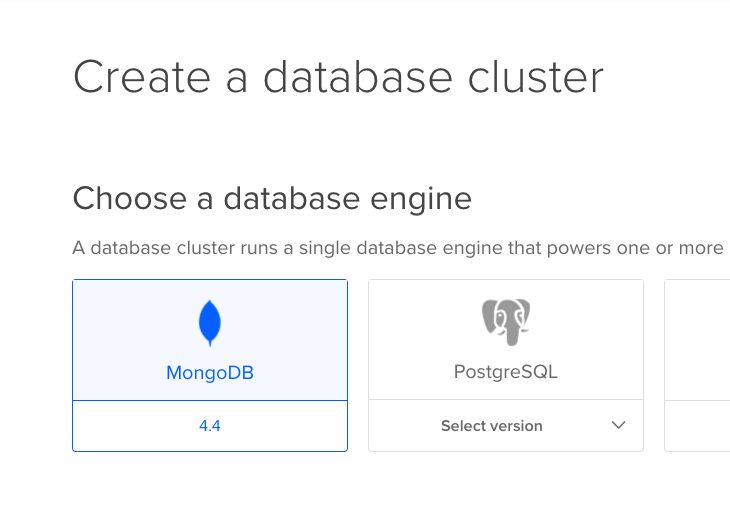
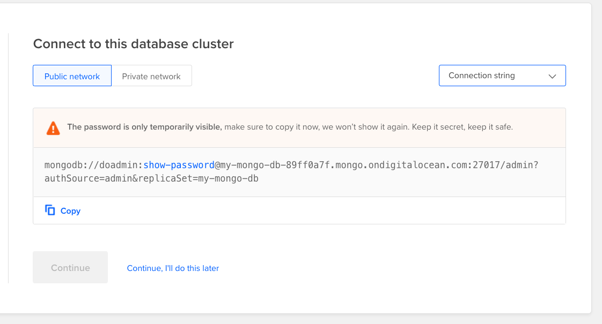
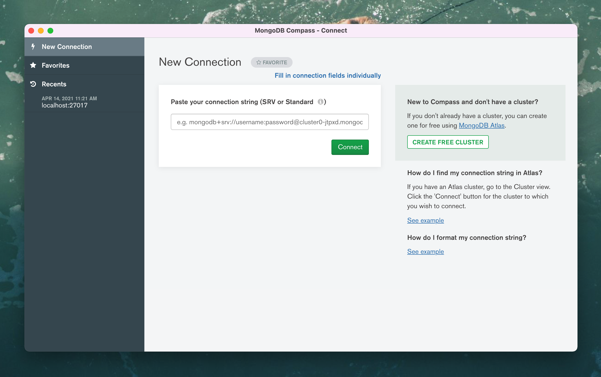
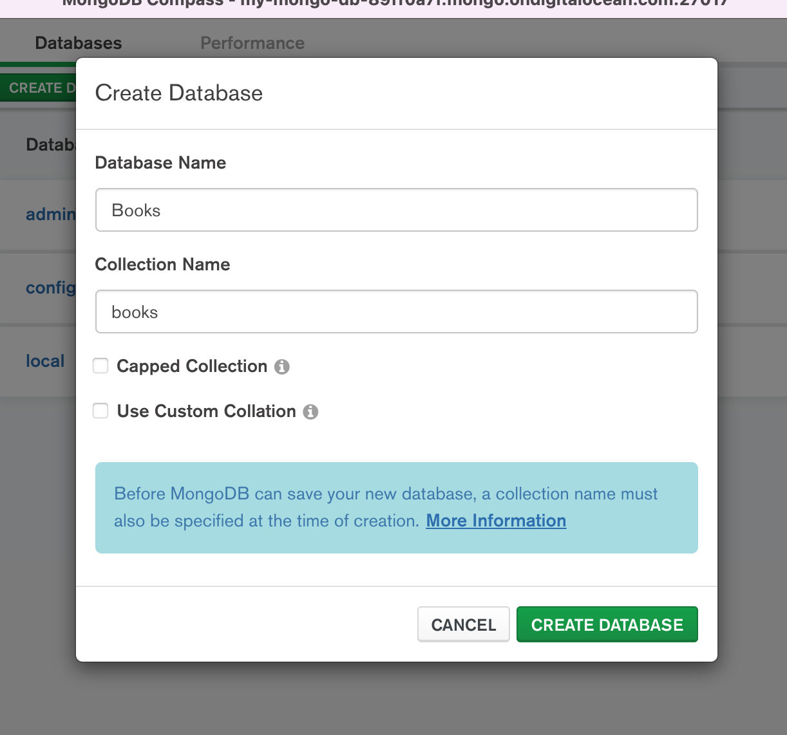
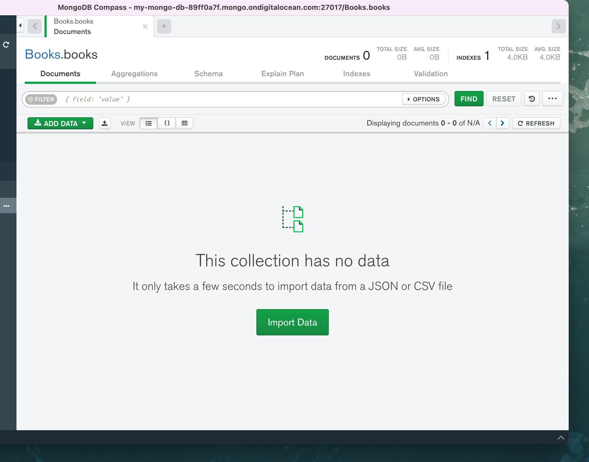
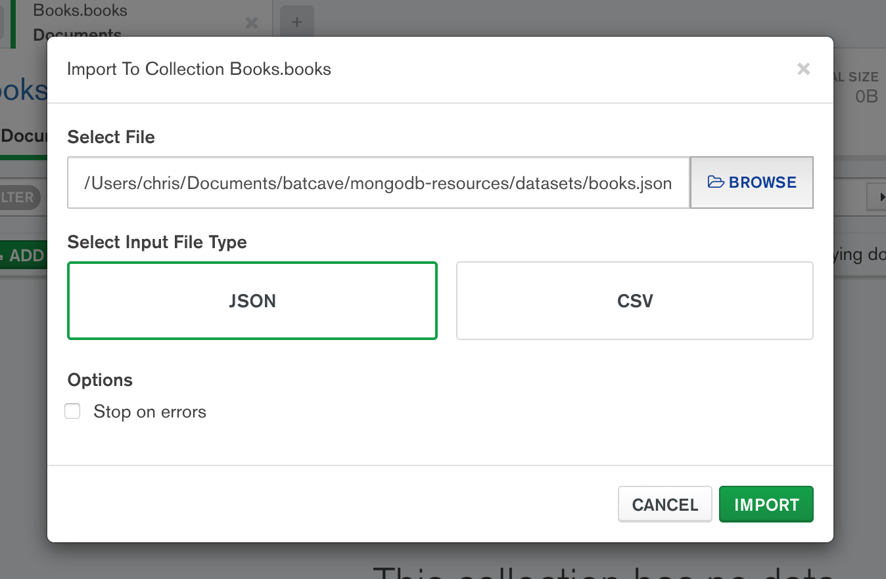

# How to Add Sample Data to MongoDB

This tutorial will use the sample datasets (particularly the [books.json](/datasets/books.json) dataset). You will use the dataset to add data to a new MongoDB database. 

You will use a desktop application called MongoDB Compass to:

- Connect to your database
- Import `.json` datasets
- Visualize your data

## The Overall Steps

1. Create a [DigitalOcean](https://digitalocean.com) account
2. Create a new [MongoDB database](https://www.digitalocean.com/products/managed-databases/)
3. Download [MongoDB Compass](https://www.mongodb.com/products/compass)
4. Connect to your database
4. Import Data using MongoDB Compass

## Walkthrough

Once you have your DigitalOcean account, go into your [DigitalOcean Dashboard](https://cloud.digitalocean.com/databases) and create a MongoDB databse.

Once you create your database, you'll be given credentials. Choose **Connection string** from the dropdown so you can see a single line to copy. You will be using this connection string to connect to your database from MongoDB Compass.

Download MongoDB Compass and connect to your database using your credentials.

Now create a database.

Click into your new database and collection and you will see an **Import Data** button.

Use that to upload the dataset found in this GitHub repo.

Now you can see your data!

## Next Steps

Check out the [sample applications](README.md) to see how to connect your applications to your new database. For instance, one of the demo apps has a Node app connecting to the database using [Mongoose](https://mongoosejs.com/).